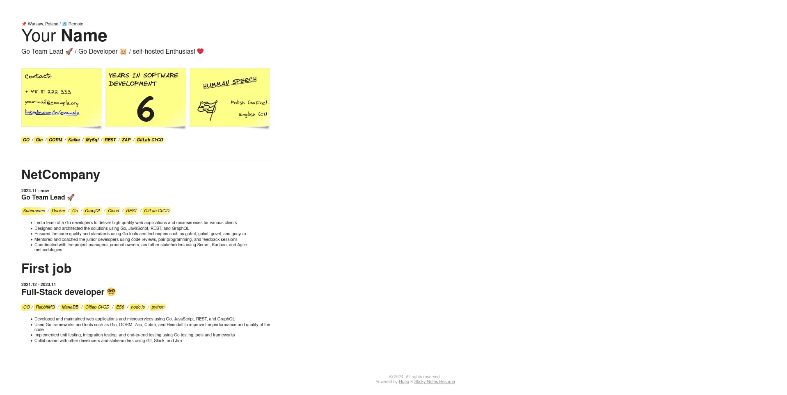

# Sticky Notes Resume Theme for Hugo

A swift, minimalist, and responsive Hugo resume theme with sticky-note highlights for essential information.



## Features

- Responsive Design: Looks great on all devices.
- Sticky Note Highlights: Essential information stands out like a sticky note.
- Customizable Information: Easily update your phone number, email, LinkedIn profile, and language proficiency information and more.
- Telephone numbere and e-mail addres obsfuction - Your telephone number and e-mail address are not displayed directly on the website. An obsfuction mechanism is used to prevent leakage of your sensitive data.
- Emoji Support: Add personality to your resume with emojis.

## Installation

Run command inside your Hugo ebpage main folder.
```bash
hugo mod get -u github.com/devintrap/sticky-notes-resume
```
Add or change hugo config

toml:
```toml
theme = ["github.com/devintrap/sticky-notes-resume"]
```

yml:
```yaml
theme: ["github.com/devintrap/sticky-notes-resume"]

```

## Configuration
